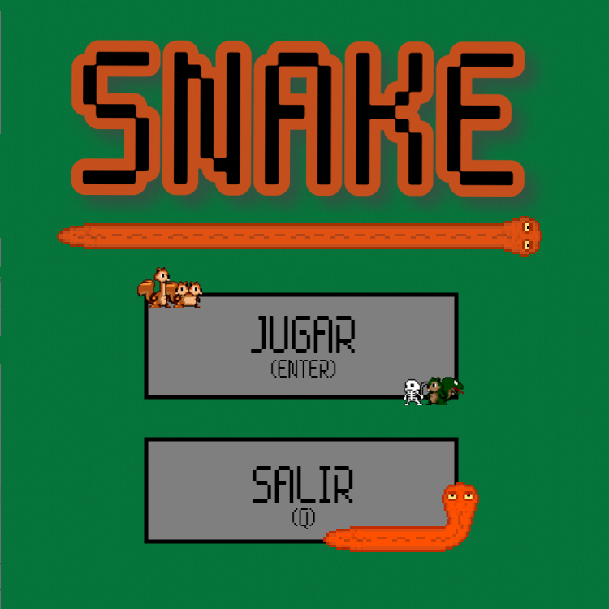

### Snake

#### Grupo: SnakeGame

Integrantes:

- Tomas Cowes
- Ezequiel Rodas
- Tomas Sanchez

#### Descripción e instrucciones

Recreacion del clasico SnakeGame con algunos retoques personales.

#### Teclas:
	
Q(Salir)

Enter(Jugar)

Flecha Arriba(Cambiar direccion hacia arriba)

Flecha Abajo(Cambiar direccion hacia abajo)

Flecha Derecha(Cambiar direccion hacia derecha)

Flecha Izquierda(Cambiar direccion hacia izquierda)
	
#### NPCs:

Ardilla Comun: Ardilla comun la cual te cruzas en un arbol. 

Puntos = 1

Ardilla Con Dos Cabezas: Ardilla modificada geneticamente para que posea 2 cabezas. 

Puntos = 2

Ardilla Muerta: Ardilla la cual no sabemos si murio por causas naturales pero esta aca para molestarnos en el camino. 

Puntos = 0

Ardilla Vengadora: No ibamos a dejar que las ardillas muertas esten ahi para siempre. La Ardilla Vengadora esta aca para salvarnos. 

Puntos = 1

PD: No quedo para el casting de avengers. 